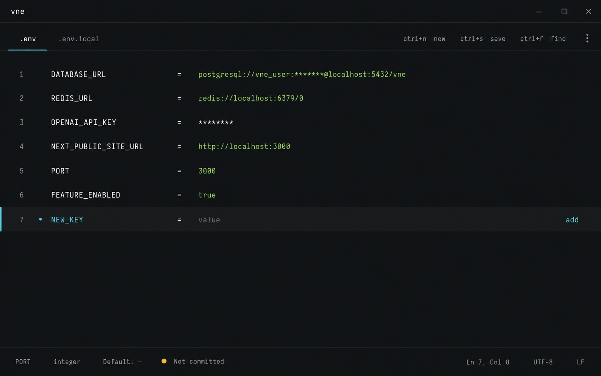

# vne

A local `.env` editor and CLI that keeps secret values out of your terminal, your logs, and your AI agent's context.

`vne` treats an env file as structured configuration, not text. You find a key, see what kind of value it wants, change it, and go back to the app. Comments, order, quoting, and multiline values stay as they were. An agent can hand you a `vne` command to run, and you type the secret yourself.

- Desktop app: Tauri 2 shell, Svelte interface, Rust parser.
- CLI: the same parser, one binary, `vne`.
- Local only: no telemetry, no accounts, no sync, no network path for env data.



## Install

Requires Node, Rust 1.82 or newer, and the [Tauri 2 prerequisites](https://tauri.app/start/prerequisites/).

```sh
npm install
npm run install:local
```

Use `install:local` rather than plain `cargo install --path src-tauri`. Tauri release binaries need the `custom-protocol` feature to load the bundled interface, and the script sets it. Release packaging is not done yet.

## Use

Open the desktop editor on a project:

```sh
vne .
```

Or work from the CLI. Commands that read or write one key:

```sh
vne create .env                          # empty, owner-private; never overwrites
vne add .env FEATURE_FLAG=true           # non-secret value: fine as an argument
vne add .env OPENAI_API_KEY --prompt     # secret: typed locally, hidden
vne set .env OPENAI_API_KEY --prompt     # replace one existing value
vne rename .env OPENAI_KEY OPENAI_API_KEY
vne rm .env STALE_FLAG
vne copy ../other/.env DATABASE_URL .env # value never leaves the Rust process
vne example .env                         # add missing keys to .env.example as blanks
```

Commands that look at files:

```sh
vne inspect .                              # every env file in a project
vne check .env --example .env.example      # missing, extra, shared, duplicate keys
vne where OPENAI_API_KEY . ~/.config/keys  # which file holds a key, and whether it is set
```

`where` searches the current directory when given no path, and only the paths you name otherwise.

`vne help` lists every option; `vne <command> --help` has examples.

### Run a command with keys

```sh
vne run ~/.config/keys/fal.env -- falgen image "a lighthouse"
vne run .env .env.local -- npm run dev
```

`run` loads the files into that one command's environment. Your shell, and every other process, never holds the keys. This replaces `set -a; source keys.env`, which puts every key into every process, where `env`, `ps eww`, or a crash dump can print them.

Files are read as data, not shell code. `run` refuses to start if a line is not an entry, an entry is malformed or repeated, a key is defined in two files, or a quoted value uses an escape other than `\\` and an escaped quote. It also refuses `env`, `printenv`, and `sh -c` scripts that list the environment. That check catches a slip, not a caller who wants the value: any program you run can print what it receives. Reasoning: [ADR 0005](docs/adr/0005-run-loads-env-files-into-one-child.md).

## What the editor and CLI understand

- **Key meaning.** URL/DSN, secret, public frontend variable, bool, int, port, JSON, PEM, and common provider keys are labelled inline. A public-prefixed name that looks secret, such as `NEXT_PUBLIC_API_KEY`, is flagged as browser-exposed.
- **Duplicates.** `add` refuses a duplicate and prints the existing line numbers. The editor asks which occurrence to change. `rm` needs `--line <N>` or `--all` for a duplicated key.
- **Faithful edits.** One occurrence changes; comments, order, quote style, `export` prefixes, and multiline values around it do not. Tests cover CRLF, UTF-8 BOM, empty values, inline comments, `#` inside values, and the [adversarial corpus](fixtures/adversarial-dotenv).
- **File discovery.** `.env`, `.env.local`, `.env.production`, `.env.example`, `.env.sample`, `.envrc`, `.flaskenv`, plus files named by `package.json` scripts (`--env-file`, `dotenv -e`, `env-cmd -f`, `DOTENV_CONFIG_PATH`) and Docker Compose `env_file`. A symlink or special file with one of these names in the project directory is not followed; the scan reports it as not read.
- **Layers.** Reports overrides across real env files. It names a winner only when Next.js or Vite load-order rules explain it.
- **Git exposure.** `inspect` and `check` report each file, and `where` each match, as `tracked`, `untrackedIgnored`, `untrackedNotIgnored`, `outsideRepository`, or `unknown`. Every write warns on stderr if it landed in a tracked file. The warning never blocks the write.
- **Refuses what it cannot prove.** `rename` refuses when the old key is gone and the new one is present, because file state cannot show that a rename produced it. `--expect present|absent` turns a wrong belief about a key into exit 2.

## Privacy

Env values never appear in vne's output.

| Surface | What it shows |
| --- | --- |
| Desktop snapshot | Secret-like values, secret-like inline comments, and credential-bearing URLs redacted. Reveal fetches one selected occurrence into the local webview and clears it on hide, selection change, reload, or save. |
| CLI JSON (piped output) | No values, comments, or raw previews. Each entry's `valueState` says `set`, `empty`, or `placeholder`. `--values` adds values the classifier judges non-secret; detected secrets stay redacted. |
| `create`, `copy`, `set`, `rm`, `rename`, `example` | Receipts only: disposition, paths, key names, line numbers. |
| `where` | Key name, paths, line numbers, git status, each value's state, and which discovered files it did not read. |
| `run` | Prints nothing. The command it starts receives the values and can print them. |
| `format --dry-run` | Prints raw values. Refuses piped stdout and asks for an interactive `y`. |

Two limits. Some facts about values do appear: a disposition such as `alreadyPresent` tells the caller that the value it supplied equals the stored one, and `valueState` tells whether a value is empty or a template such as `changeme`. And any local process with file access can read env files directly. Threat model and release checklist: [docs/THREAT_MODEL.md](docs/THREAT_MODEL.md).

## Development

```sh
npm run dev          # browser preview on fake data (127.0.0.1:1420)
npm run tauri dev    # desktop app
npm run check        # svelte-check
npm run build
npm run test         # vitest
npm run test:rust    # cargo test
scripts/security-check.sh
```

Run the CLI from source:

```sh
cargo run --manifest-path src-tauri/Cargo.toml --bin vne -- inspect fixtures/demo
```

`fixtures/demo` holds fake env files for trying the editor; in the native app, choose **Choose folder** and select it. `fixtures/holdouts` holds small fake Next.js and Vite projects for the load-order checks.

Design decisions are recorded in [docs/adr](docs/adr).

## Status

Version 0.1.0, pre-release. No packaged installer yet; install from source as above.
